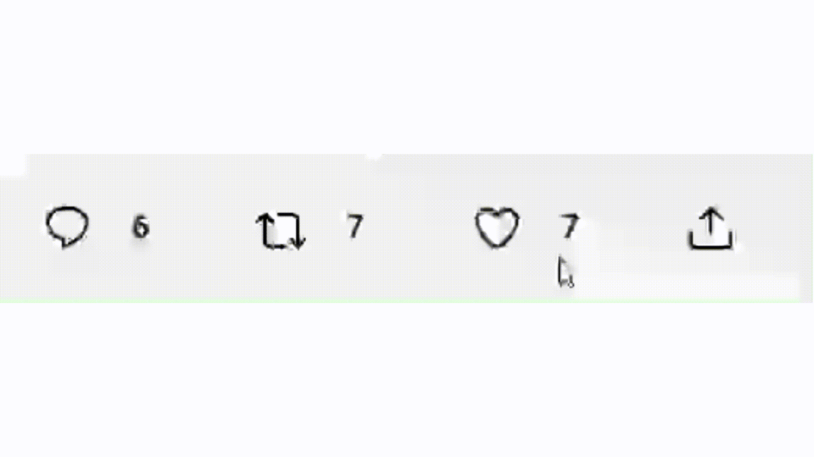

<!-- PROJECT LOGO -->
<br />
<div align="center">
  <a href="https://github.com/chaofan-w/React-mui-twitterClone">
    
  </a>

  <h3 align="center">  
  my frontend dev practice - twitter clone
  </h3>

  <p align="center">
    <br />
    <a href="https://github.com/chaofan-w/React-mui-twitterClone/blob/master/README.md"><strong>Explore the docs »</strong></a>
    <br />
    <br />
    <a href="https://frontend-twitter-clone.netlify.app/" style="font-weight:800">View Demo Site</a>
    ·
    <a href="https://github.com/chaofan-w/React-mui-twitterClone/issues">Report Bug</a>
    ·
    <a href="https://github.com/chaofan-w/React-mui-twitterClone/issues">Request Feature</a>
  </p>
</div>

<!-- TABLE OF CONTENTS -->
<details>
  <summary>Table of Contents</summary>
  <ol>
    <li>
      <a href="#about-the-project">About The Project</a>
      <ul>
        <li><a href="#built-with">Built With</a></li>
        <li><a href="#data-structure">Data Structure</a></li>
      </ul>
    </li>
    <li>
      <a href="#getting-started">Getting Started</a>
      <ul>
        <li><a href="#prerequisites">Prerequisites</a></li>
        <li><a href="#installation">Installation</a></li>
      </ul>
    </li>
    <li><a href="#contributing">Contributing</a></li>
    <li><a href="#license">License</a></li>
    <li><a href="#contact">Contact</a></li>
  </ol>
</details>

<!-- ABOUT THE PROJECT -->

## About The Project

[![Product Name Screen Shot][product-screenshot]](https://frontend-twitter-clone.netlify.app/)

This is a Twitter-Clone web application built with React and styled with Material-UI. The app allows users to post tweets, follow other users, like/dislike, reply, comment and view their own and other users' tweets and profile page.

Features:

- Tweet creation: Users can create tweets with up to 140 characters.

- Profile page: Users can view their own profile and see their tweets, followers, and following.

- Follow/unfollow: with customized button component and animation.

- Like/dislike: with customized button component and animation.
  </br>
  

- Search: Users can search for other users by username.

- Styling: The app is styled with Material-UI, making it mobile-responsive and user-friendly.

- Tweet feed: The home page displays a feed of tweets from users that the current user follows.

<p align="right">(<a href="#about-the-project">back to top</a>)</p>

### Built With

- [![JavaScript][javascript.js]][javascript-url]
- [![React][react.js]][react-url]
- [![MaterialUI][materialui.js]][materialui-url]
- [![netlify][netlify.js]][netlify-url]
- [![Python][python]][python-url] for generating users and tweets

<p align="right">(<a href="#about-the-project">back to top</a>)</p>

### Data Structure & Preparation

- Data preapration via Python tweepy library to access Twitter API

```sh
import tweepy

# Add your Twitter API keys and access tokens
consumer_key = 'YOUR_CONSUMER_KEY'
consumer_secret = 'YOUR_CONSUMER_SECRET'
access_token = 'YOUR_ACCESS_TOKEN'
access_token_secret = 'YOUR_ACCESS_TOKEN_SECRET'

# Authenticate your API keys and access tokens
auth = tweepy.OAuthHandler(consumer_key, consumer_secret)
auth.set_access_token(access_token, access_token_secret)

# Create API object
api = tweepy.API(auth)


try:
userList = ['vlotero', 'will_s_t', 'PopovichN', 'HarvardGrwthLab', 'bbcarts', 'parabolestudio', 'nataliexdean', '_rospearce'],
# generating random following and followed accounts for user in the userList
def randomaccountpicking():
    randomlist = random.choices(list(filter(lambda x: (x != user), userList)), k=random.choice(range(0, len(userList) - 1)))
    randomset = set(randomlist)
    return list(randomset)

jsonList = []
    for user in userList:
        user_id = user
        count = 1
        print('crawling user %s data...' % user_id)

        tweets = []
        new_tweets = api.user_timeline(user_id, count=count)
        tweets.extend(new_tweets)

        for tweet in tweets:
            # print(int(round(tweet.created_at.timestamp())))
            showImg = random.choice([False, True])
            item = {
              'userId': f"{tweet.user.id}",
                'userName': f"{tweet.user.name}",
                'userScreenName': f"{tweet.user.screen_name}",
                'profileImgUrl': f"{tweet.user.profile_image_url_https}",
                'userLocation': f"{tweet.user.location}",
                'userStartDate': int(round(tweet.user.created_at.timestamp())),
                'userDescription': f"{tweet.user.description}",
                'profileBkgImgUrl': f"{tweet.user.profile_background_image_url}",
                'userFollowingAccounts': randomaccountpicking(),
                'userFollowedByAccounts': randomaccountpicking(),
            }
       jsonList.append(item)

```

- user information:

```sh
{
    "userId": "60853301",
    "userName": "Nikita Rokotyan",
    "userScreenName": "ernaem",
    "profileImgUrl": "https://pbs.twimg.com/profile_images/1534367962664251393/7bpaPjBc_normal.jpg",
    "userLocation": "Bay Area",
    "userStartDate": 1248785162,
    "userDescription": "Data Visualization at F5, co-creator of https://t.co/Du6ufw40P1 and https://t.co/oSTXIOBmC7, founder of https://t.co/mWcqmCrkXf",
    "profileBkgImgUrl": "http://abs.twimg.com/images/themes/theme13/bg.gif",
    "userFollowingAccounts": [
      "Deloitte",
      "TheEconomist",
      "BainAlerts",
      "GlobalBC",
      "janm_uiux",
      "JustinTrudeau",
      "rcourt"
    ],
    "userFollowedByAccounts": [
      "JustinTrudeau",
      "GlobalBC",
      "BainAlerts",
      "Reuters",
      "TheEconomist",
      "rcourt",
      "adage",
      "francoislegault"
    ]
  },

```

- tweets

```sh
 {
    "tweetId": "1602410376477409280",
    "text": "RT @ernaem: \ud83e\udd73 Say hi to Unovis \ud83d\udc4b\n\nI'm excited to announce that Unovis \u2013 a data vis library I've been working on for more than 3 years \u2013 goe\u2026",
    "imgAttachmentUrl": "",
    "timestamp": 1670897379,
    "favoriteCount": [
      "JustinTrudeau",
      "adage",
      "TheEconomist",
      "mtlgazette",
      "NASA",
      "BainAlerts",
      "rcourt",
      "GlobalBC"
    ],
    "retweetCount": ["janm_uiux", "adage", "francoislegault", "GlobalBC"],
    "replyCount": ["nytimes", "janm_uiux", "adage", "GlobalBC"],
    "userReplyToUserId": "None",
    "userReplyToUserScreenName": "None",
    "userId": "60853301",
    "userName": "Nikita Rokotyan",
    "userScreenName": "ernaem",
    "profileImgUrl": "https://pbs.twimg.com/profile_images/1534367962664251393/7bpaPjBc_normal.jpg"
  },
```

<!-- GETTING STARTED -->

## Getting Started

This is an example of how you may give instructions on setting up your project locally.
To get a local copy up and running follow these simple example steps.

### Prerequisites

- npm
  ```sh
  npm install npm@latest -g
  ```
  or
- yarn

  ```sh
  npm install yarn@latest -g

  ```

### Installation

To install this application, please follow these steps:

1. Clone the repo
   ```sh
   git clone https://github.com/chaofan-w/React-mui-twitterClone.git
   ```
2. Install packages

   ```sh
   npm install
   ```

   or

   ```sh
   yarn install
   ```

3. Start
   ```sh
    npm start
   ```
   or
   ```sh
    yarn start
   ```
   <p align="right">(<a href="#about-the-project">back to top</a>)</p>
   ````

<!-- CONTRIBUTING -->

## Contributing

Contributions are what make the open source community such an amazing place to learn, inspire, and create. Any contributions you make are **greatly appreciated**.

If you have a suggestion that would make this better, please fork the repo and create a pull request. You can also simply open an issue with the tag "enhancement".
Don't forget to give the project a star! Thanks again!

1. Fork the Project
2. Create your Feature Branch (`git checkout -b feature/AmazingFeature`)
3. Commit your Changes (`git commit -m 'Add some AmazingFeature'`)
4. Push to the Branch (`git push origin feature/AmazingFeature`)
5. Open a Pull Request

<p align="right">(<a href="#about-the-project">back to top</a>)</p>

<!-- LICENSE -->

## License

Distributed under the MIT License. See `LICENSE.txt` for more information.

<p align="right">(<a href="#about-the-project">back to top</a>)</p>

<!-- CONTACT -->

## Contact

Chaofan Wu
</br> ![gmail-shield] chaofan.w@gmail.com
</br> [![linkedin-shield]][linkedin-url]
</br> My Portfolio Site: www.chaofanwu.com

Project Link: [https://github.com/chaofan-w/React-mui-twitterClone](https://github.com/chaofan-w/React-mui-twitterClone)

liveDemo Link: https://frontend-twitter-clone.netlify.app/

<p align="right">(<a href="#about-the-project">back to top</a>)</p>

[linkedin-shield]: https://img.shields.io/badge/-LinkedIn-black.svg?style=for-the-badge&logo=linkedin&colorB=555
[linkedin-url]: https://www.linkedin.com/in/chaofanwu/
[product-screenshot]: ./src/assets/twitter-clone-page.png
[mongodb.js]: https://img.shields.io/badge/MongoDB-4EA94B?style=for-the-badge&logo=mongodb&logoColor=white
[mongodb-url]: https://www.mongodb.com/
[react.js]: https://img.shields.io/badge/React-20232A?style=for-the-badge&logo=react&logoColor=61DAFB
[react-url]: https://reactjs.org/
[heroku.js]: https://img.shields.io/badge/Heroku-430098?style=for-the-badge&logo=heroku&logoColor=white
[heroku-url]: https://www.heroku.com/
[netlify.js]: https://img.shields.io/badge/Netlify-00C7B7?style=for-the-badge&logo=netlify&logoColor=white
[netlify-url]: https://www.netlify.com/
[python]: https://img.shields.io/badge/Python-3776AB?style=for-the-badge&logo=python&logoColor=white
[python-url]: https://www.python.org/
[redux.js]: https://img.shields.io/badge/Redux-593D88?style=for-the-badge&logo=redux&logoColor=white
[redux-url]: https://redux.js.org/
[express.js]: https://img.shields.io/badge/Express.js-404D59?style=for-the-badge
[express-url]: https://expressjs.com/
[node.js]: https://img.shields.io/badge/Node.js-43853D?style=for-the-badge&logo=node.js&logoColor=white
[node-url]: https://nodejs.dev/en/
[javascript.js]: https://img.shields.io/badge/JavaScript-F7DF1E?style=for-the-badge&logo=javascript&logoColor=black
[javascript-url]: https://www.javascript.com/
[materialui.js]: https://img.shields.io/badge/Material--UI-0081CB?style=for-the-badge&logo=material-ui&logoColor=white
[materialui-url]: https://mui.com/
[gmail-shield]: https://img.shields.io/badge/Gmail-D14836?style=for-the-badge&logo=gmail&logoColor=white
[gmail-address]: chaofan.w@gmail.com
